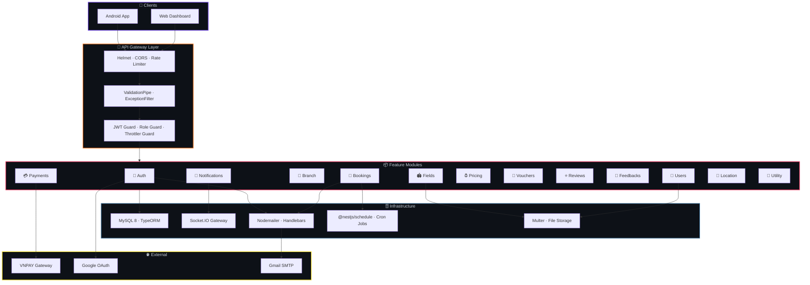
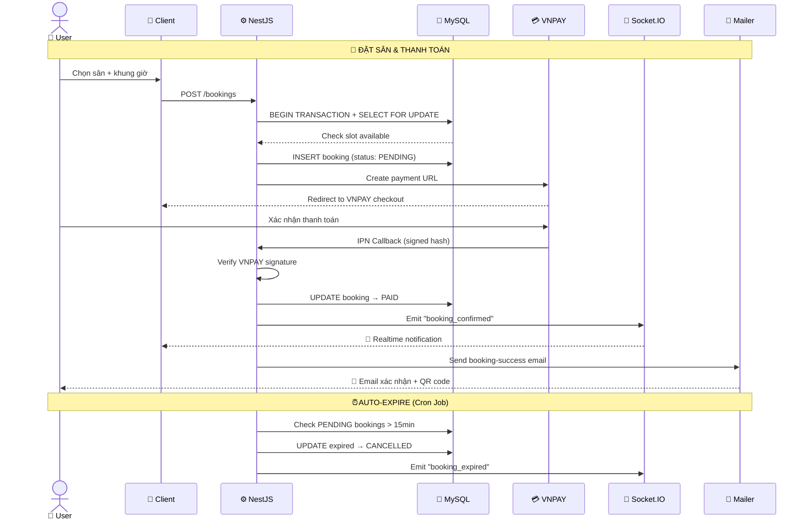

<div align="center">

<a href="http://nestjs.com/" target="blank"></a>

<br/>

# ⚙️ DATSAN — Backend API

<h3><em>RESTful API cho Nền tảng Đặt Sân Bóng Thông Minh</em></h3>

<p>
  <strong>🔐 Authentication</strong> · <strong>💳 Payment</strong> · <strong>🔔 Realtime</strong> · <strong>📊 Analytics</strong>
</p>

<br/>

[](https://nestjs.com)
[](https://www.typescriptlang.org)
[](https://www.mysql.com)
[](https://socket.io)

[](https://jwt.io)
[](https://swagger.io)
[](https://vnpay.vn)
[](https://docker.com)

<br/>

> *Hệ thống backend mạnh mẽ, bảo mật cao, hỗ trợ realtime — phục vụ đồng thời Android App & Web Dashboard*

</div>

<br/>

---

<br/>

## 📖 Giới thiệu

**Datsan Backend** là REST API server được xây dựng trên **NestJS 11** — cung cấp toàn bộ logic nghiệp vụ cho hệ sinh thái đặt sân bóng đá. Server xử lý **xác thực đa lớp**, **booking engine** chống trùng lịch, **tích hợp thanh toán VNPAY**, **thông báo realtime** qua Socket.IO, và **email transactional** với Handlebars templates.

<table>
<tr>
<td width="50%">

### 🎯 Kiến trúc & Patterns

- ✅ **Modular Architecture** — 17 feature modules độc lập
- ✅ **Repository Pattern** — TypeORM entities + services
- ✅ **Guard-based Auth** — JWT + Role-based access control
- ✅ **Global Exception Filter** — Không leak stack trace
- ✅ **DTO Validation** — `class-validator` whitelist mode
- ✅ **Cron Jobs** — Tự động check booking expired

</td>
<td width="50%">

### 🛡️ Security First

- 🔒 **Helmet** — HTTP security headers
- 🔒 **Rate Limiting** — `@nestjs/throttler` chống brute-force
- 🔒 **CORS** — Whitelist origin
- 🔒 **Data Serialization** — `@Exclude()` sensitive fields
- 🔒 **Input Sanitization** — `forbidNonWhitelisted: true`
- 🔒 **CSP Headers** — Content Security Policy

</td>
</tr>
</table>

<br/>

---

<br/>

## ✨ Tính năng chi tiết

| Module | Tính năng | Chi tiết |
|:--:|:--|:--|
| 🔐 | **Auth & Identity** | Register, Login (Email/Password), Google OAuth 2.0, OTP email verification, Forgot/Reset password, JWT Access + Refresh Token (HttpOnly Cookie) |
| 👤 | **User Management** | CRUD profile, avatar upload, role-based (User/Admin/Staff), Google account linking |
| 🏟️ | **Field Management** | CRUD sân bóng, multi-image upload, tìm kiếm theo GPS/khu vực, tiện ích đi kèm |
| 🏢 | **Branch Management** | Quản lý chi nhánh, địa chỉ GPS, liên kết với fields |
| 📅 | **Booking Engine** | Đặt sân theo time slot, **transaction locking** chống trùng lịch, auto-expire với cron jobs, status flow (Pending → Paid → Checked-in → Completed) |
| 💳 | **Payment (VNPAY)** | Tạo payment URL, IPN callback verification, refund flow, transaction history |
| ⏰ | **Dynamic Pricing** | Cấu hình giá theo khung giờ, loại sân, ngày thường/cuối tuần |
| 🎫 | **Voucher System** | CRUD voucher, validate & apply discount, usage limit tracking |
| ⭐ | **Review & Rating** | Write review + rating, average score calculation, pagination |
| 💬 | **Feedback** | Submit & manage user feedback |
| 🔔 | **Notifications** | Realtime push via **Socket.IO**, mark read, notification history |
| 📍 | **Location** | Province/District/Ward data, GPS-based search |
| 📧 | **Email Service** | Handlebars templates — Welcome, OTP, Booking success/failed/cancelled, Forgot password, Booking ticket PDF |
| 🔧 | **Utilities** | File upload (Multer, 5MB limit), serve static files, health check endpoint |

<br/>

---

<br/>

## 🏗️ Kiến trúc hệ thống



<br/>

### 📂 Cấu trúc thư mục

```
📦 backend/
├── 🐳 docker-compose.yml        # MySQL 8 container
├── ⚙️ nest-cli.json              # NestJS CLI config
├── 📋 .env.example               # Environment template
│
└── 📁 src/
    ├── 🚀 main.ts                # Bootstrap — Helmet, CORS, Swagger, Pipes
    ├── 📦 app.module.ts          # Root module — imports all feature modules
    ├── 🗄️ data-source.ts         # TypeORM DataSource config
    │
    ├── 🔐 auth/
    │   ├── auth.controller.ts    # Login, Register, OAuth, OTP, Refresh
    │   ├── auth.service.ts       # Business logic (32KB+ of auth logic!)
    │   ├── config/               # Google OAuth config
    │   ├── dto/                  # LoginDto, RegisterDto, OtpDto...
    │   ├── guards/               # JwtGuard, RolesGuard, GoogleGuard
    │   ├── strategies/           # JwtStrategy, GoogleStrategy
    │   ├── decorator/            # @CurrentUser(), @Roles()
    │   └── enums/                # Role enum (USER, ADMIN, STAFF)
    │
    ├── 👤 user/                  # User CRUD, avatar, profile
    ├── 🏟️ field/                 # Field CRUD, images, search
    ├── 🏢 branch/                # Branch management
    ├── 📅 booking/
    │   ├── booking.service.ts    # Core booking engine (37KB!)
    │   ├── booking.cron.ts       # Auto-expire pending bookings
    │   ├── entities/             # Booking entity + relations
    │   └── enums/                # BookingStatus enum
    │
    ├── 💳 payment/
    │   ├── payment.service.ts    # VNPAY integration (31KB!)
    │   ├── config/               # vnpay.config.ts
    │   └── interface/            # IVnpayConfig
    │
    ├── ⏰ pricing/               # Time slot pricing
    ├── 🎫 voucher/               # Voucher CRUD & validation
    ├── ⭐ review/                # Review & rating system
    ├── 💬 feedback/              # User feedback
    ├── 🔔 notification/          # Notification CRUD
    ├── 📍 location/              # Province/District/Ward
    ├── 🔧 utility/               # Shared utilities
    ├── 🌐 event/                 # Socket.IO WebSocket gateway
    ├── 🗄️ database/              # Database connection module
    ├── 🛠️ common/
    │   ├── http-exception.filter.ts  # Global exception filter
    │   └── dto/                  # Shared DTOs (pagination, etc.)
    │
    └── 📧 templates/             # Handlebars email templates
        ├── welcome.hbs
        ├── login-verification.hbs
        ├── forgot-password.hbs
        ├── reset-password.hbs
        ├── booking-success.hbs
        ├── booking-failed.hbs
        ├── booking-cancelled.hbs
        └── booking-ticket.hbs
```

<br/>

---

<br/>

## 🔄 Booking Flow — Sequence Diagram



<br/>

---

<br/>

## 🛡️ Security Architecture

```mermaid
graph LR
    REQ["🌐 Incoming Request"] --> HELMET["🪖 Helmet<br/>Security Headers"]
    HELMET --> CORS["🔗 CORS<br/>Origin Whitelist"]
    CORS --> THROTTLE["⏱️ Throttler<br/>50 req/min"]
    THROTTLE --> PIPE["✅ ValidationPipe<br/>Whitelist + Transform"]
    PIPE --> GUARD["🔐 JWT Guard<br/>+ Role Guard"]
    GUARD --> CONTROLLER["📡 Controller"]
    CONTROLLER --> SERIALIZER["🔒 Serializer<br/>@Exclude() fields"]
    SERIALIZER --> FILTER["🚫 Exception Filter<br/>Hide stack traces"]
    FILTER --> RES["📤 Safe Response"]

    style REQ fill:#dc2626,color:#fff,stroke:none
    style RES fill:#16a34a,color:#fff,stroke:none
    style HELMET fill:#1e293b,color:#e2e8f0,stroke:#f97316
    style CORS fill:#1e293b,color:#e2e8f0,stroke:#f97316
    style THROTTLE fill:#1e293b,color:#e2e8f0,stroke:#f97316
    style PIPE fill:#1e293b,color:#e2e8f0,stroke:#3b82f6
    style GUARD fill:#1e293b,color:#e2e8f0,stroke:#3b82f6
    style CONTROLLER fill:#1e293b,color:#e2e8f0,stroke:#8b5cf6
    style SERIALIZER fill:#1e293b,color:#e2e8f0,stroke:#8b5cf6
    style FILTER fill:#1e293b,color:#e2e8f0,stroke:#8b5cf6
```



| Layer | Công nghệ | Bảo vệ khỏi |
|:--|:--|:--|
| **HTTP Headers** | `helmet` | Clickjacking, XSS, MIME sniffing |
| **CORS** | NestJS built-in | Cross-origin attacks |
| **Rate Limiting** | `@nestjs/throttler` (50 req/min) | Brute-force, DDoS |
| **Input Validation** | `class-validator` (whitelist mode) | SQL injection, payload tampering |
| **Auth Guards** | JWT + `@Roles()` decorator | Unauthorized access |
| **Data Serialization** | `ClassSerializerInterceptor` | Sensitive data leak (password, phone) |
| **Exception Filter** | `AllExceptionsFilter` | Stack trace & path disclosure |
| **CSP** | Helmet CSP directives | XSS, script injection |
| **File Upload** | Multer (5MB limit) | Large file attacks |

<br/>

---

<br/>

## 🛠️ Tech Stack

<div align="center">

| Công nghệ | Version | Vai trò |
|:--:|:--:|:--|
|  | `11.x` | Modular API framework |
|  | `6.x` | Strongly-typed language |
|  | `8.0` | Relational database |
|  | `1.x` | ORM + migrations + transactions |
|  | — | Access + Refresh token auth |
|  | `4.x` | Realtime WebSocket events |
|  | `11.x` | Auto-generated API docs |
|  | — | Payment gateway integration |
|  | `9.x` | Transactional emails |
|  | — | Email templates (8 templates) |
|  | `8.x` | HTTP security headers |
|  | — | MySQL containerization |
|  | `9.x` | Fast package manager |

</div>

<br/>

---

<br/>

## ⚙️ Cài đặt & Chạy

### 📋 Yêu cầu

| Thành phần | Yêu cầu |
|:--|:--|
| **Node.js** | 20+ |
| **pnpm** | 9+ |
| **MySQL** | 8.0+ (hoặc Docker) |
| **Gmail App Password** | Cho email service |

### 🚀 Quick Start

```bash
# 1. Clone & install
git clone https://github.com/imfakebot/DACSIII.git
cd DACSIII/backend
pnpm install

# 2. Cấu hình environment
cp .env.example .env
# → Sửa .env theo hướng dẫn bên dưới

# 3. Khởi động MySQL (Docker)
docker compose up -d

# 4. Chạy dev server
pnpm run start:dev
```

> 🎉 Server chạy tại `http://localhost:3000`
> 📚 Swagger docs tại `http://localhost:3000/api-doc`

### 🔧 Cấu hình `.env`

```env
# ═══════════════════════════════════════
# 🗄️ DATABASE
# ═══════════════════════════════════════
DB_HOST=localhost
DB_PORT=3306
DB_USERNAME=root
DB_PASSWORD=your_password
DB_DATABASE=datsan_db
PORT=3000

# ═══════════════════════════════════════
# 🔐 JWT AUTHENTICATION
# ═══════════════════════════════════════
JWT_ACCESS_SECRET=your_access_secret_key
JWT_REFRESH_SECRET=your_refresh_secret_key
JWT_ACCESS_EXPIRATION_TIME=15m
JWT_REFRESH_EXPIRATION_TIME=7d

# ═══════════════════════════════════════
# 🔑 GOOGLE OAUTH 2.0
# ═══════════════════════════════════════
GOOGLE_CLIENT_ID=your_google_client_id
GOOGLE_CLIENT_SECRET=your_google_client_secret
GOOGLE_CALLBACK_URL=http://localhost:3000/auth/google/callback
GOOGLE_REVOKE_URL=https://oauth2.googleapis.com/revoke

# ═══════════════════════════════════════
# 💳 VNPAY PAYMENT
# ═══════════════════════════════════════
VNP_TMN_CODE=your_tmn_code
VNP_HASH_SECRET=your_hash_secret
VNP_URL=https://sandbox.vnpayment.vn/paymentv2/vpcpay.html
VNP_RETURN_URL=http://localhost:3000/payment/vnpay-return
VNP_IPN_URL=http://localhost:3000/payment/vnpay-ipn
VNP_API_URL=https://sandbox.vnpayment.vn/merchant_webapi/api/transaction

# ═══════════════════════════════════════
# 📧 EMAIL (Gmail SMTP)
# ═══════════════════════════════════════
MAIL_HOST=smtp.gmail.com
MAIL_USER=your_email@gmail.com
MAIL_PASS=your_gmail_app_password
MAIL_FROM=your_email@gmail.com

# ═══════════════════════════════════════
# 🌐 FRONTEND & MOBILE
# ═══════════════════════════════════════
FRONTEND_URL_WEB=http://localhost:4200
BASE_URL=http://localhost:3000
MOBILE_DEEPLINK_URL=dacsii://

# ═══════════════════════════════════════
# ⏰ BUSINESS RULES
# ═══════════════════════════════════════
OPEN_HOUR=6
END_HOUR=23
```

<br/>

---

<br/>

## 📚 API Endpoints

### 🔐 Auth (`/auth`)

| Method | Endpoint | Mô tả | Auth |
|:--:|:--|:--|:--:|
| `POST` | `/auth/register` | Đăng ký tài khoản | ❌ |
| `POST` | `/auth/login` | Đăng nhập (Email/Password) | ❌ |
| `POST` | `/auth/verify-otp` | Xác thực OTP email | ❌ |
| `POST` | `/auth/resend-otp` | Gửi lại OTP | ❌ |
| `POST` | `/auth/forgot-password` | Gửi email reset password | ❌ |
| `POST` | `/auth/reset-password` | Đặt lại mật khẩu | ❌ |
| `POST` | `/auth/refresh` | Refresh access token | 🍪 |
| `POST` | `/auth/logout` | Đăng xuất | 🔑 |
| `GET` | `/auth/google` | Google OAuth redirect | ❌ |
| `POST` | `/auth/google/mobile` | Google OAuth cho mobile | ❌ |

### 👤 Users (`/users`)

| Method | Endpoint | Mô tả | Auth |
|:--:|:--|:--|:--:|
| `GET` | `/users/profile` | Lấy profile hiện tại | 🔑 |
| `PATCH` | `/users/profile` | Cập nhật profile | 🔑 |
| `PATCH` | `/users/avatar` | Upload avatar | 🔑 |

### 🏟️ Fields (`/fields`)

| Method | Endpoint | Mô tả | Auth |
|:--:|:--|:--|:--:|
| `GET` | `/fields` | Danh sách sân (search, filter, pagination) | ❌ |
| `GET` | `/fields/:id` | Chi tiết sân | ❌ |
| `POST` | `/fields` | Tạo sân mới | 🛡️ Admin |
| `PATCH` | `/fields/:id` | Cập nhật sân | 🛡️ Admin |
| `DELETE` | `/fields/:id` | Xoá sân | 🛡️ Admin |

### 📅 Bookings (`/bookings`)

| Method | Endpoint | Mô tả | Auth |
|:--:|:--|:--|:--:|
| `POST` | `/bookings` | Tạo booking mới | 🔑 |
| `GET` | `/bookings/history` | Lịch sử booking | 🔑 |
| `GET` | `/bookings/:id` | Chi tiết booking | 🔑 |
| `POST` | `/bookings/:id/cancel` | Huỷ booking | 🔑 |
| `POST` | `/bookings/:id/checkin` | QR check-in | 🛡️ Staff |

### 💳 Payments (`/payment`)

| Method | Endpoint | Mô tả | Auth |
|:--:|:--|:--|:--:|
| `POST` | `/payment/create` | Tạo VNPAY payment URL | 🔑 |
| `GET` | `/payment/vnpay-return` | VNPAY return redirect | ❌ |
| `GET` | `/payment/vnpay-ipn` | VNPAY IPN callback | ❌ |

> **Legend:** ❌ Public · 🔑 JWT Required · 🍪 Refresh Cookie · 🛡️ Role Required

<br/>

---

<br/>

## 🧪 Testing

```bash
# Unit tests
pnpm run test

# E2E tests
pnpm run test:e2e

# Coverage report
pnpm run test:cov
```

<br/>

---

<br/>

## 🐳 Docker

```bash
# Khởi động MySQL container
docker compose up -d

# Kiểm tra container
docker ps

# Dừng container
docker compose down
```

<br/>

---

<br/>

## 📝 License

```
MIT License — Copyright (c) 2026 Tanh (Datsan)
```

<br/>

---

<br/>

<div align="center">

**DATSAN Backend** — *Powering the pitch, one API at a time.* ⚽

<br/>

Made with ❤️ by [**DACSIII Team**](https://github.com/imfakebot/DACSIII)

*Đồ án Chuyên sâu II — 2026*

</div>
